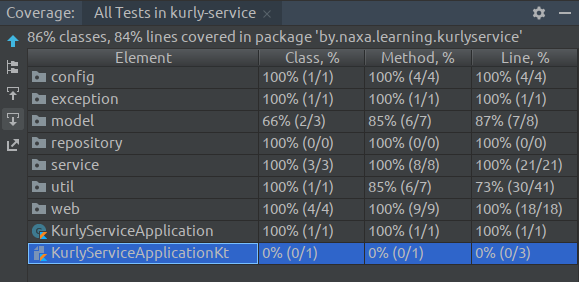

# Getting Started Guide

## App Description

**kURLy** - a microservice for URL shortening written in [Kotlin](https://kotlinlang.org/).

### Requirements

* develop a small microservice with a single endpoint that takes a big URL and responds with a shortened version
* when sending the shortened URL to another endpoint, the service redirects to the desired destination URL
* clean code covered with unit tests
* embedded database like H2
* readme file with instruction on how to run the service

The desired microservice is located in [kurly-service] module.
Additionally, I developed some infrastructure around this microservice in order to demonstrate how it works in a real microservices environment.
More info in [Implementation](#implementation) section.

## Getting Started

This section describes various ways of deploying the application in development environment (localhost).

### Prepare

Before the first build you need to take additional steps.

 1. Clone the [repository](https://github.com/naXa777/spring-cloud-url-shortener)
 2. Install JDK 8+
 3. Install Docker + Docker Compose

### Build Using Gradle Wrapper

This project uses [Gradle](https://gradle.org/) build tool for simplifying build process and dependency management.
It's distributed with a Gradle Wrapper so you don't need to download and install Gradle yourself.

```bash
./gradlew build [-x test]
```

### Run Using Docker

The fastest way to run this application locally is to build artifacts with Gradle and then run `docker-compose -f docker-compose.dev.yml up`.

[docker-compose.dev.yml](docker-compose.dev.yml) is configured to build images locally and expose containers ports for convenient development.

### Run Using Gradle

Define environment variable `SPRING_PROFILES_ACTIVE=local`.

You can run the developed microservice in a standalone mode:

```bash
./gradlew :kurly-service:bootRun
```

Or run microservices one by one (to get infrastructure up & running).

1. Required:

    ```bash
    ./gradlew :discovery-server:bootRun
    ./gradlew :config-server:bootRun
    ./gradlew :kurly-service:bootRun
    ```

2. Optional:

    ```bash
    ./gradlew :kurly-app:bootRun
    ./gradlew :turbine:bootRun
    ./gradlew :hystrix-dashboard:bootRun
    ```

### Build and Run Using IntelliJ IDEA

1. Import root project in IntelliJ IDEA
2. Sync project files with Gradle (initial sync may happen automatically)
3. Now you should have multiple run configurations for every module. Run them one-by-one:
    1. DiscoveryServerApplication
    2. ConfigServerApplication
    3. KurlyServiceApplication
    4. KurlyAppApplication
    5. TurbineApplication
    6. HystrixDashboardApplication

Tip: if you run multiple instances of the same service (scaling),
     make sure that you run them on different ports and these ports are free, otherwise you'll get an error.

## Database

When runnning in Docker, database type is MySQL and it's shared between `kurly-service` instances.

Connection string:

    jdbc:mysql://localhost:3306/kurly

When running via Gradle or IntelliJ IDEA, database type is H2 in-memory (embedded mode).
Database data doesn't survive `kurly-service` restart.

Connection string:

    jdbc:h2:mem:testdb

## Important endpoints

* http://localhost:9000 - Kurly Service (back-end)
* http://localhost:8761 - Eureka Dashboard
* http://localhost:8080/hystrix - Hystrix Dashboard

Less important endpoints:

* http://localhost:3000/turbine.stream - Turbine Stream (not exposed in Docker)
* http://localhost:8888 - Configuration Service (not exposed in Docker)
* http://localhost:8000 - Kurly Application (front-end, not ready yet)

### Back-end API

* `POST /shorten`
    body: `{"url": "https://long.url/"}`
* `GET /:shortCode`

## Tests

There're unit and integration tests in [kurly-service] module.
Additionally, there're primitive `contextLoads` tests in other modules.

|  |
| :--------------------------------------------: |
| Test coverage of kurly-service: 84% LoC        |

### Manual testing

[HTTPie](https://httpie.org/) commands:
```bash
http post localhost:9000/shorten url="https://placekitten.com/200/287"
http get localhost:9000/1
```

### CI

Travis CI builds and tests the application

[](https://travis-ci.com/naXa777/spring-cloud-url-shortener)

## Implementation

The main part of this project is `kurly-service` module - a microservice for URL shortening.

This project demonstrates such features of microservices architecture as:

* Service Discovery (Eureka)
* Centralized Configuration ([git repo](https://github.com/naXa777/spring-cloud-url-shortener-config))
* Circuit Breaker (Hystrix)
* Monitoring (Turbine + Hystrix Dashboard)

The implemented URL shortening service assigns a unique key to every long URL passed to `/shorten` endpoint.
For the sake of simplicity, entity ID is used as a unique key.
For better scalability, a numeric ID (base 10) is converted to alphanumeric representation (base 64) using base conversions.
Which results in shorter keys and therefore shorter links. A custom Base64 charset contains:

    10 digits + 26 uppercase letters + 26 lowercase letters + dash + underscore

A short link produced by kURLy looks like `http://localhost:9000/1aTd0H` (case sensitive) and consists of `baseUrl` + `shortLink`.
The `baseUrl` is configurable for easier deployment / domain migration.

The short code is stored in DB and when GET request is processed it's used to retrieve a corresponding long URL.
If the retrieval is successful, `kurly-service` redirects to the long URL (`302 Found`).

An original URL may be very long (browsers support up to ~200KB strings) 
so the corresponding column type in DB is `MEDIUMTEXT` in order to fit any URL.

### Technologies

* Kotlin
* Gradle
* IntelliJ IDEA
* Docker + Docker Compose
* Spring Boot 2
* Spring Cloud
* Spring Data
* Hibernate
* Travis CI
* Git
* Database: H2 or MySQL

...

## Roadmap

The project is not finished yet. Future work:

* `kurly-app` module which should be a gateway to `kurly-service`.
* Swagger UI documentation
* Design and front-end
* HTTPS
* Public deployment
* Load testing
* Improvement: filter allowed protocols
* Improvement: collect analytics
